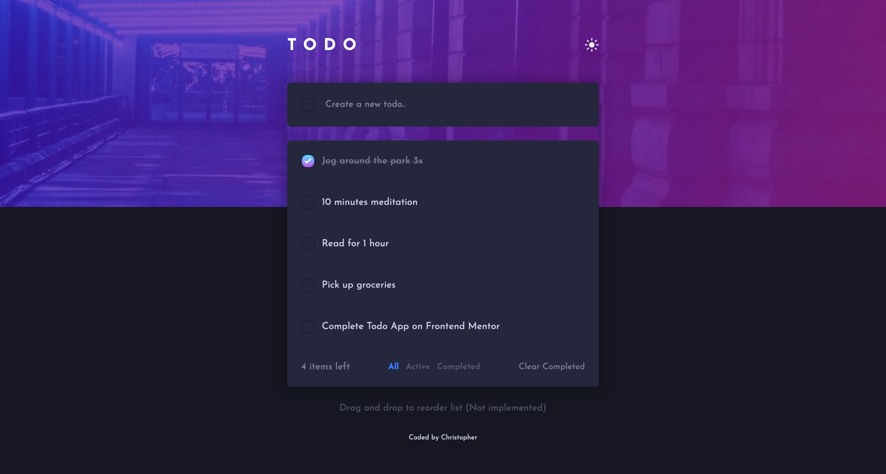
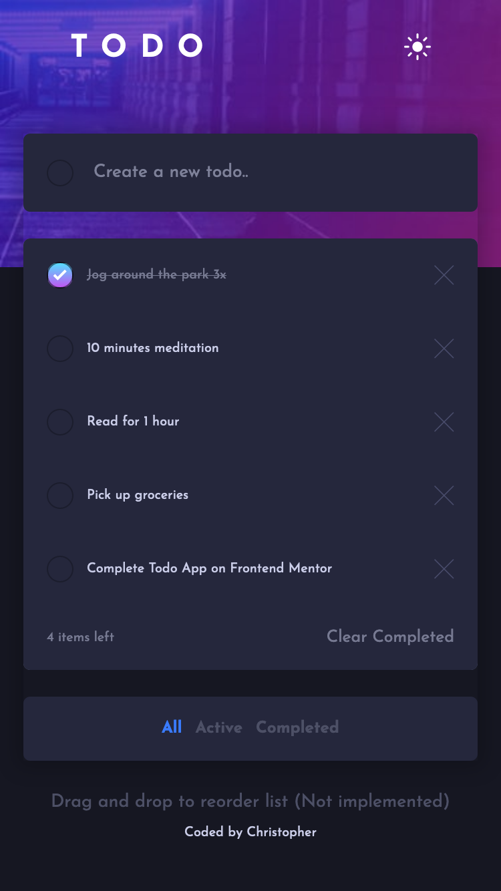

# Frontend Mentor - Todo app solution

This is a solution to the [Todo app challenge on Frontend Mentor](https://www.frontendmentor.io/challenges/todo-app-Su1_KokOW). Frontend Mentor challenges help you improve your coding skills by building realistic projects. 

## Table of contents

- [Overview](#overview)
  - [The challenge](#the-challenge)
  - [Screenshot](#screenshot)
  - [Links](#links)
  - [Built with](#built-with)
- [Author](#author)

## Overview

### The challenge

Users should be able to:

- View the optimal layout for the app depending on their device's screen size
- See hover states for all interactive elements on the page
- Add new todos to the list
- Mark todos as complete
- Delete todos from the list
- Filter by all/active/complete todos
- Clear all completed todos
- Toggle light and dark mode
- **Bonus**: Drag and drop to reorder items on the list

### Screenshot

### Links

- Solution URL: [Add solution URL here](https://github.com/donchriscorleone/frontend-mentor-todo-app)
- Live Site URL: [Add live site URL here](https://donchriscorleone.github.io/frontend-mentor-todo-app/)

### Built with

- Semantic HTML5 markup
- CSS custom properties
- Flexbox
- CSS Grid
- Mobile-first workflow
- Vanilla JavaScript

## Author

- LinkedIn - [@christopheriilajom](https://www.linkedin.com/in/christopher-ii-lajom-031959211/)
- Frontend Mentor - [@donchriscorleone](https://www.frontendmentor.io/profile/donchriscorleone)
- Instagram - [@christopheriilajom](https://www.instagram.com/christopheriilajom)
## Authors

- [@christopheriilajom](https://www.github.com/donchriscorleone)

## 🔗 Links

